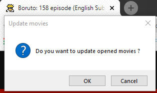

Favorite series unseen
===

In short description, it checks if a new episode had appeared, and then let you choose how many you can open in one click for viewing the new one(s).

## Motivation

How would it be if you would not check manually, if it appeared a new episode or more episodes from your favorite series, all done automatically ? Thus it takes your worries about opening same pages, but rather the solicitude of don't loseing some movies. This is how the wish of automation with python it occured.

## Screenshots

In **Screenshot 1** you can select easily how many new episodes want to see from each movie.  


In **Screenshot 2** you are prompted if you want to update where you have left of watching movies. This is usefull for testing or debuging.  


## Tech/framework used

**Built with**

   * [Python](https://docs.python.org/3/) ( verssion 3.8.3) running on Windows 7, 64 bit

**Modules used**
   * *os* ......................... -> changing the curent folder of saving shelves dictionary variables
   * *shelve* ................ -> saving informations after I closed the python code
   * *requests*  ............ -> accessing webpage without open it
   * *webbrowser*  ..... -> open webpage
   * *beautifulSoup4* -> parse html
   * *re* ......................... -> take the link for each episode
   * *time* ......................... -> open episodes in order
   * *pyautogui* ................ -> checking for update

## Prerequisites

You need to install some third party modules first, from Comand Line in `Python\Scripts` :

   - Install requests  
```
pip install requests
```

   - Install beautifulSoup  
```
pip install beautifulsoup4
```

## Installation

   1. Put the folder in your name documents or where ever you want  
Make sure you have `seriesFavorite.py` in the same folder as `series.dat`, `series.bak`, and `series.dir`.

## Obtional

If you want this program to run everytime you start / log on on your pc, then ...  
  1. Make a batch file  
open notepade, or any text editor, and enter this :  
```
@py C:\Users\Cristian\MyPythonScripts\seriesFavorite\seriesFavorite.py
```  
Make sure you put your path till seriesFavorite.py program.

  2. And then I recomment added on the next line, for time to review if none episodes appeared :
```
@pause
```

  3. Save the file as **.bat** ( from batman :) ). I saved `startUp.bat`

  4. On widows : in `start \ search bar`, type this :
```shell:startup```

  5. Paste the shortcut in this folder.

Done !

## Usage example

  * If you want to see 1 movie, type :  
```1```  (bellow each question)

  * If you want to see more movies, type the number of your movies you want to see :  
```3```

  * If you want to skip a number of movies, you will need to open that number of episodes, in order to update the database :  
```47```

  * If you want to cancel, type :  
```0```

  * If none new movies appeared, the message it will be:  
```Didn't appeared any new episode from the Flash``` ( idem for Boruto)

### Reset

If you want to reset the episodes from the very begining, firstly open Idle Python shell, and change the path for your current folder :
```
import os
os.chdir('C:\\Users\Cristian\MyPythonScripts\seriesFavorite')
```

And then please run this code :
```
import shelve
shelvFile = shelve.open('series')
shelvFile['Flash'] = [1, 1] # For Flash
shelvFile['Boruto] = 1 # for Boruto
```

### Issues
  * If you typed a non-integer value like a space, a new line, question mark , a text , you will get error :  
`Exception: only integer numbers allowed !`

  * If you typed a negative integer number, you will get :  
`Exception: You can't open negative new movies.`

  * If you have to open more new movies, that you actually have at your disposition, you will get:  
`Exception:  You can't open more new movies, than they already appeared.`

## Contributing

Pull requests are welcome. If you need to see other movies or series, or if you have ideas of improvement, included how can make this section better, you can write them as a request, or  [email me](mailto:cristif92@gmail.com?subject=seriesFav%20-%20) with the subject *seriesFav* included.

Note that requests for xxx movies aren't taken into account, at all. Also minor changes.

## Author
  * Cristian Florescu  - [Cristishor201](https://github.com/Cristishor201)

## License

This project is licensed under the **GNU General Public License v3.0** - see the [LICENSE.md](LICENSE) file for details.
